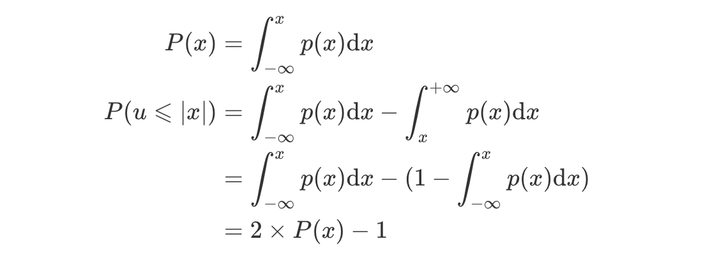

# 摩点集资监控与抽卡插件(基于coolq-aiohttp)

## 简介

基于[richardchien/python-aiocqhttp](https://github.com/richardchien/python-aiocqhttp)的摩点集资监控以及抽卡机器人

抽卡逻辑参考了[CQBot_hzx/branch-lottery](https://github.com/chinshin/CQBot_hzx/tree/branch-lottery)的实现, 并作出少许修改

在处理请求上使用Python提供的asyncio机制, 订单量大时在并发处理的效率更高(**理论上**)

使用`APScheduler`进行定期的任务调度

数据库使用MySQL

测试环境: `macOS`+`Python3.7`+`Mysql8`

### 消息示例

```
感谢 XXX 支援了XXX.XX元
{集资项目}
https://m.modian.com/project/{pro_id}
进度: XXX/XXXX | (XX.XX%)
支持人数: X
距离结束还剩【X小时Y分钟Z秒】
----------------
恭喜获得新卡!
[图片]
本次积分: 0 获得卡牌:
{卡牌名} × 1
----------------
目前支持榜前5的聚聚是:
A:α元
B:β元
C:δ元
D:σ元
E:ω元
```

## 依赖

`aiohttp`, `asyncio`, `aiomysql`, `aiocqhttp`, `uvloop` (不支持Windiws操作系统), `APScheduler`

## 存在问题

- 使用CQ码进行图片发送, 疑似不支持绝对路径? (仅在Windows系统测试过), 若消息中需要显示卡牌图片,请配置好coolq机器人文件目录后在CQ码中使用相对路径

- `aiohttp`不支持直接使用`response.json()`方法解析摩点返回的响应, 现采取先使用`response.text()`以文本方式读取响应体再使用`json.loads()`解析响应体, 摩点有一定几率返会空白(不定期发生), 导致解析JSON抛异常 ~~(真的不是因为懒得修)~~

- 处理订单以及发送消息时使用并发任务, 因此群内消息接收到的顺序与订单顺序不一定会一致, 若对顺序要严格要求,可转用使用同步API实现的插件

- 代码耦合, 现版本会对所有监听中的集资项目进行抽卡

- 暂不支持响应群成员发送的消息

- 积分系统未经测试, 可能存在bug ~~(没有人用过)~~

## 使用方法

**注意:** 由于Python对异步代码的支持有版本限制, 请使用Python3.6及以上版本

### 创建数据库

使用`database.sql`创建对应的数据库以及数据表

```shell
mysql –u username –p password < ./database.sql
```

### 虚拟环境创建

建议使用虚拟环境

#### Linux, macOS操作系统

进入项目根目录运行以下命令创建并激活虚拟环境，详细教程可查看[官方文档](https://docs.python.org/zh-cn/3.7/library/venv.html)

```bash
python3 -m venv ./
source bin/activate
```

#### Windows

Windows cmd

```cmd
c:\> python3 -m venv ./
c:\> \Scripts\activate.bat
```

Powershell

```powershell
PS C:\> python3 -m venv ./
PS C:\> \Scripts\Activate.ps1
```

### 依赖安装

虚拟环境创建完成并激活虚拟环境后运行`pip install -r requirement.txt`安装项目依赖 (Windows用户需要先把文件中`uvloop`去掉)

### 配置文件

运行前需要先对数据库, CQBot机器人, 抽卡卡牌, 摩点监听进行配置

#### 数据库配置

文件位于`db/config.py`

示例:

```python
config = {
    "host": "localhost",
    "port": 3306,
    "user": "",
    "password": "",
    "db": "modian"
}
```

#### CQBot机器人配置

文件位于 `bot/config.py`

示例:

```python
config = {
    # 是否开启消息发送
    "enable": True,
    # Coolq API运行所在的服务器
    "url": "http://hostname:port",
    # 口令校验 没有口令校验的写成None
    "access_token": None",
    # 接收发送消息的QQ群
    "qqGroup": ""
}
```

其中, 在于HTTP插件的信息交互上, 可以使用websocket ~~(现在还没写, 以后会有的)~~

#### 抽卡卡牌配置

文件位于`lottery/configs/config.py`

示例:

```python
config = {
    # 卡牌存放的根目录(本地)
    "cardPoolFilePrefix": "/path/to/your/cardpoolfolder",
    # 卡牌文件在coolq所在的服务器存放的路径根目录(远端服务器, 如运行在同一个服务器, 则无需配置)
    # 貌似 使用CQ码不能使用绝对路径?
    # 注意检查coolq发送文件的路径前缀配置
    # 此处为相对路径配置
    "remoteFilePrefix": "cardpool",
    # 单次抽取卡牌的基数金额(为保证准确, 请使用字符串类型)
    "baseMoney": "13.14",
    # 卡牌的版本号
    "version": 2,
    # 重复抽卡后的累计积分
    # 计算代码在 lottery/Lottery.py#line26
    "score": {
        "N": 5,
        "R": 10,
        "SR": 20,
        "SSR": 50,
        "UR": 200
    }
}
```

#### 摩点监听配置

文件位于 `modian/configs/ModianConfig.py`

示例:

```python
config = {
    # 开启中的所有的集资项目pro_id,
    "pro_ids": ['11111', '22222'],
    # 需要监听的日常集资的pro_id, 可以多个
    "daily": {
        "pro_ids": ['11111']
    },
    # 需要监听的pk集资
    # "pk": {
    #     # 自家集资pro_id
    #     "me": "22222",
    #     # 对家集资pro_id列表
    #     "vs": ['33333']
    # }
    # 日常集资监听频率
    "dailyInterval": 25,
    # 集资pk监听频率
    "pkInterval": 30
}
```

监听频率不建议设置得过于频繁 ~~(太red了那就另说了)~~

### 数据库卡牌数据初始化

在首次使用之前, 或更换卡牌套装之后, 需要进行卡牌数据初始化 **(记得在配置文件中更换版本号)**

卡牌的存放方式按照目录结构分等级放置,示例如下(文件名将会成为以后抽卡的卡牌名称):

cardpool
├── N
│  ├── N1.png
│  ├── ...
├── R
│  ├── R1.png
│  ├── ...
├── SR
│  ├── SR1.png
│  ├── ...
├── SSR
│  ├── SSR1.png
│  ├── ...
└── UR
   ├── UR1.png
   └── ...

配置好卡牌文件夹, 卡牌配置文件以及数据库配置文件, 数据库创建好后, 运行`lottery/InitCardData.py`即可将卡牌数据写入数据库中

#### 启动监听

运行`ModianListener.py`, 即可开启监听

## 其他

### 抽卡概率实现

抽卡卡牌等级选择实现在`lottery/Core.py#pickCardLevel`, 卡牌选择在`lottery/Core.py#pickCard`

基于标准正态分布可得:
$$
\begin{aligned}
P(x)&=\int_{-\infty}^{x}p(x){\rm d}x\\
P(u\leqslant|x|)&=\int_{-\infty}^{x}p(x){\rm d}x-\int_{x}^{+\infty}p(x){\rm d}x\\
&=\int_{-\infty}^{x}p(x){\rm d}x-(1-\int_{-\infty}^{x}p(x){\rm d}x)\\
&=2\times P(x)-1
\end{aligned}
$$

(图片)



以下是进行$1\times10^5$次单抽随机试验的结果
卡牌等级|理论概率|实验出现频次|实验概率
---|---|---|---
N|59.14%|59071|59.07%
R|27.50%|27453|27.45%
SR|9.12%|9178|9.18%
SSR|3.63%|3702|3.70%
UR|0.61%|596|0.60%

### TODO

- 日志记录
- 自动重抽
- 使用[richardchien/nonebot](https://github.com/richardchien/nonebot)与QQ群交互
- 积分兑换抽卡
- 消息模板分离